University year: 2025/2026 (L2) \
Name: Fenniche Moncef \
Group: G2

# Annuaire Téléphonique

First we define the followings :

```c
typedef struct {
    char Num[15];
    struct NumNode* Next;
} NumNode;

typedef NumNode* NumPtr;
```
*which will be used in the struct of contact :*
```c
typedef struct {
    char Nom[50];
    char Prenom[50];
    char Relation[25];
    NumPtr Nums;
    struct contact* Next;
} contact;

typedef contact* Annuaire;
```
These are the functions that allows us to print each contact of 'Annuaire' :

```c
void printContact(contact c) {
    printf("Nom:       %s\n", c.Nom);
    printf("Prenom:    %s\n", c.Prenom);
    printf("Relation:  %s\n", c.Relation);
    printf("Numeros: ");
    NumPtr n = c.Nums;
    while (n != NULL) {
        printf("- %s\n", n->Num);

        if (n->Next != NULL) printf("         ");

        n = n->Next;
    }
    printf("---\n");
}

void printAnnuaire(Annuaire A) {
    contact * c = A;
    printf("---\n");
    if (A == NULL) {
        printf("Annuaire est vide\n---\n");
    }
    while (c != NULL) {
        printContact(*c);
        c = c->Next;
    }
}
```
---

## Ajouter des contacts

```c
void addContact(Annuaire* A, char nom[], char prenom[], char relation[], NumPtr nums) {
    contact* c = (contact*)malloc(sizeof(contact));
    if (c != NULL) {
        strcpy(c->Prenom, prenom);
        strcpy(c->Nom, nom);
        strcpy(c->Relation, relation);
        c->Nums = nums;
        c->Next = *A;
        *A = c;
    }
}
```
Example for verification:
```c
Annuaire A = NULL;

printAnnuaire(A);

char *n[] = {"+21325123123"};
addContact(&A, "Feniche", "Moncef", "Me", createNumsList(n, 1));

printf("After adding new contact:\n");
printAnnuaire(A);
```

|  |  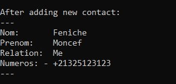 |
|--|--|

```c
char *n1[] = {"+112345678900", "+15550123456"};
addContact(&A, "Peterson", "John", "Colleague", createNumsList(n1, 2));
char *n2[] = {"+213544332211"};
addContact(&A, "Chaabane", "Abdelrahmene", "Colleague", createNumsList(n2, 1));
char *n3[] = {"3015"};
addContact(&A, "ALG", "Poste", "Service", createNumsList(n3, 1));

printf("After adding several new contacts:\n");
printAnnuaire(A);
```

| 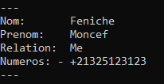 |  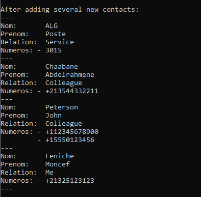 |
|--|--|


---

## Rechercher un contact

```c
contact searchContact(Annuaire A, char nom[], char prenom[]) {
    contact* c = A;
    while (c != NULL) {
        if (strcmp(c->Nom,nom) == 0 && strcmp(c->Prenom,prenom) == 0) {
           return *c;
        }
        c = c->Next;
    }
    return nullContact;
}
```

Example for verification:

```c
contact* foundC = searchContact(A, "Peterson", "John");

printf("After searching for 'Peterson John' :\n");
if (foundC == NULL)
    printf("Contact wasn't found.\n");
else {
    printf("Contact was found:\n");
    printContact(*foundC);
}
```

| 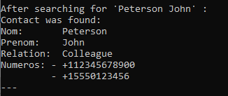 |
|--|

---

## Supprimer un contact

```c
void deleteContact(Annuaire* A, char nom[], char prenom[]) {
    contact *c = *A, *cPrv = NULL;
    while (c != NULL) {
        if (strcmp(c->Nom,nom) == 0 && strcmp(c->Prenom,prenom) == 0) {
            if (c == *A)
                *A = c->Next;
            else
                cPrv->Next = c->Next;

            NumPtr n = c->Nums;
            while (n != NULL){
                NumPtr nTmp = n;
                n = n->Next;
                free(n);
            }
            free(c);
            return;
        }
        cPrv = c;
        c = c->Next;
    }
}
```
Example for verification:

```c
deleteContact(&A, "ALG", "Poste");

printf("After deleting 'ALG Poste' contact :\n");
printAnnuaire(A);
```

| 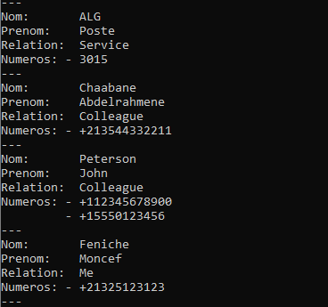 |  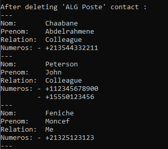 |
|--|--|

---

## Modifier un contact

```c
void modifyContact(Annuaire* A, char nom[], char prenom[], char novNom[], char novPrenom[], char novRel[]) {
    contact *c = *A;
    while (c != NULL) {
        if (strcmp(c->Nom,nom) == 0 && strcmp(c->Prenom,prenom) == 0) {
            strcpy(c->Nom, novNom);
            strcpy(c->Prenom, novPrenom);
            strcpy(c->Relation, novRel);
            return;
        }
        c = c->Next;
    }
}
```

Example for verification:

```c
modifyContact(&A, "Feniche", "Moncef", "Fenniche", "Moncef", "Personal");

printf("After modifying 'Feniche' contact :\n");
printf("Feniche -> Fenniche , Me -> Personal\n");
printAnnuaire(A);
```

| 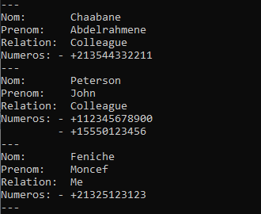 |  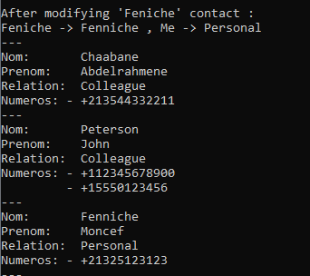 |
|--|--|


---

## Fusionner les contacts en double

```c
void mergeContacts(Annuaire* A) {

    contact *c = *A;
    while (c != NULL) {
        contact *dPrv = c;
        contact *d = c->Next;
        while (d != NULL) {
            if ((strcmp(c->Nom, d->Nom) == 0) &&
                (strcmp(c->Prenom, d->Prenom) == 0) &&
                (strcmp(c->Relation, d->Relation) == 0))
            {
                dPrv->Next = d->Next;
                NumPtr cTail = c->Nums;
                while (cTail->Next != NULL) cTail = cTail ->Next;
                cTail->Next = d->Nums;

                contact* dTmp = d;
                d = d->Next;
                free(dTmp);
            } else {
                dPrv = d;
                d = d->Next;
            }

        }
        c = c->Next;
    }
}
```

Example for verification:

```c
addContact( &A, "Fenniche", "Moncef", "Personal", createNumsList((char*[]){"+213777001122"}, 1));

printf("After adding a duplicate contact :\n");
printAnnuaire(A);

mergeContacts(&A);

printf("After merging duplicates :\n");
printAnnuaire(A);
```

| 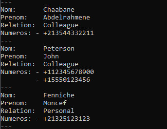 |  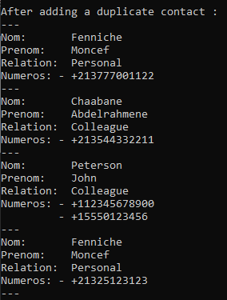 |  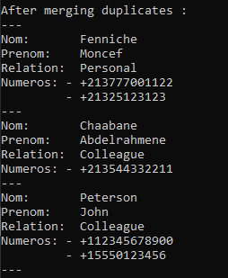 |
|--|--|--|

---

## Créer un sous-carnet

```c
Annuaire subContacts(Annuaire A, char criteria[]) {
    Annuaire subA = NULL;
    contact* subATail = NULL;
    contact *c = A;

    while (c != NULL) {
        if (strcmp(criteria, c->Relation) == 0) {
            contact* newC = (contact*)malloc(sizeof(contact));
            if (subA == NULL) {
                subA = newC;
                subATail = subA;
            } else {
                subATail->Next = newC;
                subATail = newC;
            }
            subATail->Next = NULL;
            strcpy(subATail->Nom, c->Nom);
            strcpy(subATail->Prenom, c->Prenom);
            strcpy(subATail->Relation, c->Relation);

            NumPtr n = c->Nums;
            NumPtr nums = NULL, numsTail = NULL;
            while (n != NULL) {
                NumPtr newN = (NumPtr)malloc(sizeof(NumNode));
                newN->Next = NULL;
                strcpy(newN->Num, n->Num);
                if (nums == NULL) {
                    nums = newN;
                    numsTail = newN;
                } else {
                    numsTail->Next = newN;
                    numsTail = newN;
                }

                n = n->Next;
            }
            subATail->Nums = nums;

        }
        c = c->Next;
    }
    return subA;
}
```

Example for verification:

```c
Annuaire colA = subContacts(A, "Colleague");

printf("Sous-Annuaire of 'Colleague': \n");
printAnnuaire(colA);
```

| 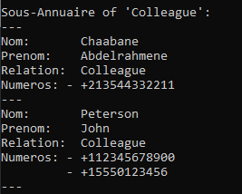 |
|--|

---

## Sauvegarder et charger

```c
void saveAnnuaire(Annuaire A, char* fname) {
    FILE* f = fopen(fname, "wb");
    if (f != NULL) {
        contact* c = A;
        while (c != NULL) {
            fwrite(c->Nom, sizeof(c->Nom), 1, f);
            fwrite(c->Prenom, sizeof(c->Prenom), 1, f);
            fwrite(c->Relation, sizeof(c->Relation), 1, f);
            NumPtr n = c->Nums;
            while (n != NULL ){
                fwrite(n->Num, sizeof(n->Num, 1, f);
                n = n->Next;
            }
            char nullStr[sizeof(n->Num)] = "";
            fwrite(nullStr, sizeof(n->Num, 1, f);

            if (c->Next != NULL){
                fwrite(">", sizeof(char), 1, f); // bch yindiquer bli kayn contact morah
            } else {
                fwrite("X", sizeof(char), 1, f); // bch yindiquer bli fmak y7bs annuaire
            }

            c = c->Next;
        }

        fclose(f);
    }
}
```

Example for verification:

```c
saveAnnuaire(colA, "sous.anr");
    
printf("'Colleague' Sous-Annuaire is saved in 'sous.anr'\n");
```

|  <br/>  |
|--|


```c
int loadAnnuaire(Annuaire* A, char* fname) {
    while ((*A) != NULL) {
        deleteContact(A, (*A)->Nom, (*A)->Prenom);
    }

    FILE* f = fopen(fname, "rb");
    if (f != NULL) {
        char whatsNext;
        do {
            contact c;
            if (!fread(c.Nom, sizeof(c.Nom), 1, f )) return 0;
            if (!fread(c.Prenom, sizeof(c.Prenom), 1, f)) return 0;
            if (!fread(c.Relation, sizeof(c.Relation), 1, f)) return 0;
            c.Nums = NULL;

            NumPtr tail = NULL;
            char numBuff[sizeof(c.Nums->Num)];
            do {
                if (!fread(numBuff, sizeof(numBuff, 1, f)) return 0;
                if (numBuff[0] == '\0') break;

                NumPtr n = (NumPtr)malloc(sizeof(NumNode));

                if (n == NULL) return 0;

                n->Next = NULL;

                strcpy(n->Num, numBuff);
                if (c.Nums == NULL) {
                    c.Nums = n;
                    tail = n;
                } else {
                    tail->Next = n;
                    tail = tail->Next;
                }
            } while (!feof(f));

            addContact(A, c.Nom, c.Prenom, c.Relation, c.Nums);

            fread(&whatsNext, sizeof(char), 1, f);

        } while (whatsNext == '>');
        fclose(f);
        return 1;
    }
    *A = NULL;
    return 0;
}
```
Example for verification:

```c
// loadAnnuaire deletes any contact inside 'A'
loadAnnuaire(&A, "sous.anr");

printf("'Colleague' Sous-Annuaire is loaded from 'sous.anr'\n");
printAnnuaire(A);
```


| 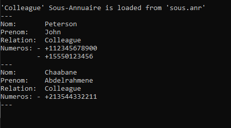 |
|--|
